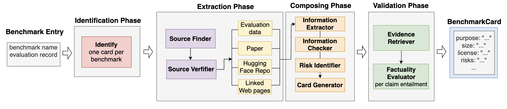

# Auto-BenchmarkCards

Auto-BenchmarkCards produces structured documentation for AI benchmarks from
evaluation records, papers, dataset repositories, and linked web sources. It
records source provenance, composes a 40-field BenchmarkCard, and checks
eligible claims against the collected evidence.

This repository contains research code and evaluation artifacts for
*Auto-BenchmarkCards: Automated Documentation for AI Benchmarks*. The Python
package and command retain the singular name `auto_benchmarkcard` and
`benchmarkcard` for compatibility.



## Paper release

Use the following resources for distinct purposes.

| Resource | Role |
|---|---|
| [GitHub release `v0.2.0`](https://github.com/evaleval/auto-benchmarkcard/releases/tag/v0.2.0) | Versioned research code and evaluation release |
| [Hugging Face revision `0a86cea5…`](https://huggingface.co/datasets/evaleval/auto-benchmarkcards/tree/0a86cea5b55d6070bd7f1f020f01281e1631adba) | Frozen evaluated corpus of 530 JSON cards |
| `Auto-BenchmarkCards-code-and-data.zip` attached to the GitHub release and the arXiv submission | Frozen paper artifact with the code, all 530 cards, provenance, and replay inputs |
| [Evaluation Cards](https://evalcards.evalevalai.com/) | Live community deployment; dynamic and not used to compute the paper's results |

The frozen corpus is a research snapshot with known defects, not a
human-verified reference database. Subsequent corrections to the living corpus
do not change the inputs analyzed in the paper.

## Important interpretation limits

- In the stratified sample, an estimated 47.80% of cards had at least one
  screen-detected and verifier-confirmed material finding. This is not an
  estimate of overall defect prevalence because the screen's recall is unknown.
- In the overlapping filled-field universe, post-composition warnings had
  3.03% weighted precision and 1.86% recall for source-unsupported content.
  They are review cues, not correctness certificates.
- Each card contains a `possible_risks` list produced by a separate risk
  identifier. In the sampled cards, the automated source judge classified 547
  of 761 candidate risk assertions as relevant and grounded in the collected
  evidence and 214 as not. These judgements were not human-validated and are
  excluded from the headline field-support results. Treat every item as a
  prompt for human review, not as a verified property of a benchmark.

No headline result in the paper depends on the candidate risk assignments.

## Repository contents

- `src/auto_benchmarkcard/`: package and command-line application
- `scripts/`: batch generation, corpus assembly, and evaluation programs
- `tests/`: offline and artifact-backed regression tests
- `eval/`: frozen evaluation sample, results, public human-label projections,
  manifests, and checksums
- `docs/`: architecture notes and figure sources
- `spaces/benchmarkcard-webhook/`: optional Hugging Face Space integration

The public evaluation snapshot is based on 531 attempted entries and 530
published cards. See [`eval/README.md`](eval/README.md) for result scopes,
artifact locations, sanitization policy, and offline reproduction commands.
The complete corpus and per-field provenance ship in the release archive.

## Install

Auto-BenchmarkCards requires Python 3.11 or newer.

```bash
git clone --branch v0.2.0 https://github.com/evaleval/auto-benchmarkcard.git
cd auto-benchmarkcard
python3.12 -m venv .venv
source .venv/bin/activate
python -m pip install --upgrade pip
python -m pip install -e .
```

Copy `.env.example` to `.env` and add only the credentials required by your
chosen backends. `.env` is ignored by Git. The entailment stage also requires a
Merlin solver binary built from the FactReasoner revision pinned in
`pyproject.toml`; it is not vendored here.

## Run

Generate from an Every Eval Ever export:

```bash
benchmarkcard generate ./external/eee_samples \
  -b "MMLU,TruthfulQA" \
  -o ./output
```

Generate from Unitxt:

```bash
benchmarkcard generate-unitxt glue -o ./output
```

Inspect the available commands:

```bash
benchmarkcard --help
benchmarkcard validate
```

Each run writes the final card, collected source artifacts, provenance, and
factuality outputs to a timestamped directory.

## Reproduce the reported statistics

The GitHub release attaches the same code-and-data archive distributed with
the arXiv version. Its `REPRODUCIBILITY.md` gives seven offline commands for
recomputing the reported summaries from frozen model outputs and annotations.
Those commands require no credentials or new hosted-model calls.

Fresh generation is not byte-reproducible because it depends on changing web
sources and hosted models. The archive records the evaluated configuration,
software environment, frozen outputs, and checksums so the reported numerical
analysis can be replayed independently of those services.

## Development

Run the maintained test suite with:

```bash
python -m pytest
```

Additional setup and frozen-artifact rules are documented in
[`DEVELOPMENT.md`](DEVELOPMENT.md). This code follows URLs found in input
records and has not been hardened as a public network service. Run it in an
isolated environment when processing untrusted inputs; see
[`SECURITY.md`](SECURITY.md).

## Citation

Please cite the accompanying paper. The arXiv identifier will be added to
[`CITATION.cff`](CITATION.cff) after arXiv assigns it.

> Aris Hofmann, Inge Vejsbjerg, Jan Batzner, Leshem Choshen, Jenny Chim,
> Avijit Ghosh, and Elizabeth M. Daly. “Auto-BenchmarkCards: Automated
> Documentation for AI Benchmarks.” 2026.

## Licenses

| Material | License |
|---|---|
| Source code and repository documentation | [MIT](LICENSE) |
| Generated 530-card corpus | [CDLA-Permissive-2.0](CDLA-Permissive-2.0.txt) |
| Author-created evaluation instruments, reports, aggregates, and derived outputs | [CC BY 4.0](https://creativecommons.org/licenses/by/4.0/) |
| Sanitized participant label projections | Published as consented research records; no separate copyright license is asserted over participant-authored expression |
| Third-party sources, excerpts, dependencies, and benchmark content | Their original terms; see [third-party notices](THIRD_PARTY_NOTICES.md) |

[`DATA-LICENSE.md`](DATA-LICENSE.md) defines the file-level boundary. The
licenses apply only to rights held by the relevant providers and do not grant
rights over the benchmarks described by the cards.
